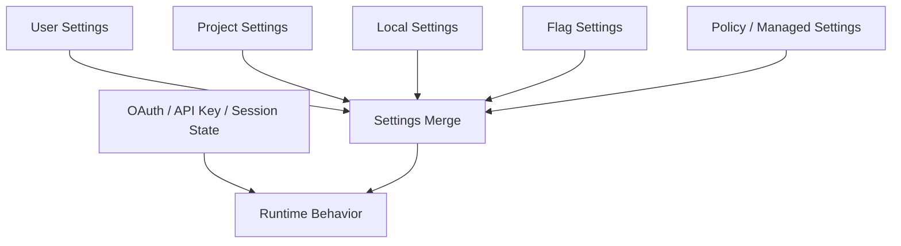

# 第 4 章：Config、Auth 与 Settings

Claude Code 的运行时从来不是裸的主循环。每一轮真正开始之前，系统已经被配置、认证状态、托管策略、用户设置、本地设置、企业策略共同塑形。

因此本章不是在讲“配置文件在哪里”，而是在讲一套更根本的事情：**谁有资格定义系统的行为边界。**

## 4.1 配置不是便利功能，而是行为法律

`note/read-144.md` 与 `Lesson/config-auth-and-settings-architecture.md` 已经把一个重要事实讲得很清楚：Claude Code 的 settings 体系不是单层覆盖，而是多来源合并秩序。

它至少涉及：

- 用户设置
- 项目设置
- 本地设置
- flag 注入
- policy settings
- 远程托管设置

这个系统真正难的地方不在“能不能改”，而在“最后到底谁说了算”。

## 4.2 为什么安全读取要排除 projectSettings

这是第二卷最值得强调的一条设计判断之一：某些安全相关决策不会读取 `projectSettings`。

原因很直接——项目目录本身可能是不可信输入。如果允许项目文件直接影响跳过危险提示、自动模式等安全行为，那么配置系统就会变成 RCE 或权限绕过的入口。

所以这里体现的不是配置能力，而是系统对**信任来源分层**的明确态度。

## 4.3 Config / Auth / Policy 关系图

## 4.4 本章小结

这一章最该留下的判断是：

> Claude Code 的配置与认证系统，不是在给功能加开关，而是在决定整个运行时的权限边界、可信来源和行为秩序。

## 来源站点

- `note/read-134.md`
- `note/read-141.md`
- `note/read-144.md`
- `Lesson/config-auth-and-settings-architecture.md`
