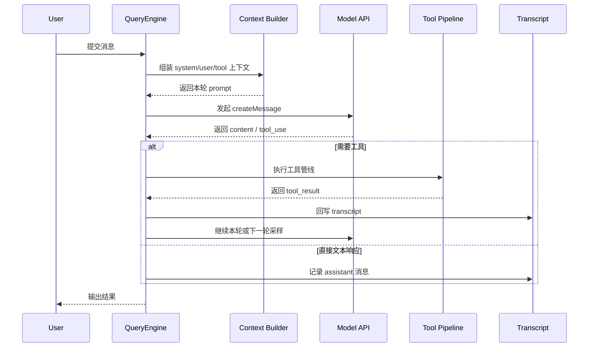
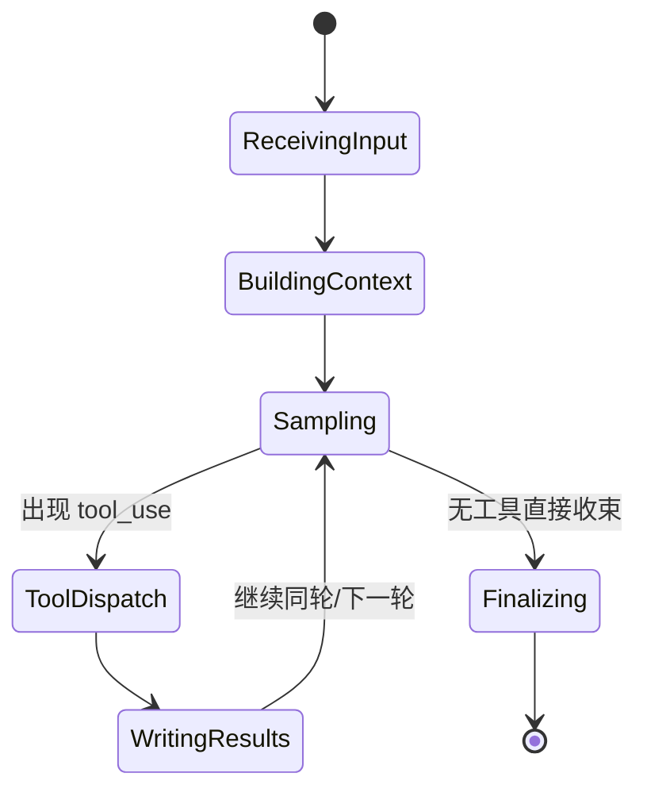

# 第 5 章：QueryEngine 与 Turn Loop

这一章是整本书的中心。因为 Claude Code 说到底不是一堆工具的集合，而是一台持续处理回合的机器。

真正的问题不是“模型怎么回答”，而是：

- 用户输入怎样进入系统；
- 上下文如何被组织；
- 工具调用如何插入中途；
- 结果怎样写回 transcript；
- 压缩、恢复、预算与中断怎样共同维持会话连续性。

## 5.1 Turn Loop 不是聊天循环，而是状态机

从 `note/read-126.md`、`note/read-130.md`、`note/read-137.md` 与 `Lesson/turn-loop-architecture.md` 可以看出，Claude Code 的主循环已经远不是“收一条消息，回一条消息”。

它内部至少需要管理：

- 输入消息与系统提示的装配；
- 模型输出内容块的分类；
- tool_use / mcp_tool_use 的分支执行；
- transcript 回注；
- 压缩与上下文预算；
- 错误恢复与对话连续性。

所以更准确的描述是：**它是一台围绕回合边界运转的状态机。**

## 5.2 为什么 QueryEngine 是运行时真正的中枢

站在源码阅读的角度，`main.tsx` 很重要，但那是启动中枢；一旦会话进入持续运转状态，真正接管局面的就是 QueryEngine 及其相邻的 turn runtime。

`note/read-137.md` 对 Query 子模块的综合指出了一个关键事实：这条链不只是“发 API 请求”，它还负责协调：

- system prompt sections 如何拼装；
- user context 与 CLAUDE.md 如何进入当前回合；
- tool_use 上下文如何与 transcript 保持成对；
- stop hooks、token budget、重试与恢复逻辑如何把异步事件重新纳入统一时钟。

也就是说，Claude Code 的回合引擎并不只是一个 while loop，而是一种**把异步输入、工具副作用与消息历史重新编排为单一会话节拍**的机制。

## 5.3 一轮对话的时序图

## 5.4 Compact 为什么是主循环的一部分

`note/read-130.md` 与 `read-149` 系列综合的重点都在强调：compact 不是外围清理工，而是主循环内部的正式分支。

一旦上下文预算逼近边界，系统就必须决定：

- 哪些消息被冻结；
- 哪些消息可以被摘要替换；
- tool result 怎样保持缓存稳定性；
- 对话怎样在压缩后仍能恢复。

这也是为什么上下文管理不该被理解为“优化”，而应被理解为 Claude Code 会话正确性的组成部分。

更进一步，compact 真正保护的不是 token，而是**对话连续性**：它保证系统在压缩之后，仍然知道自己刚刚做过什么、哪些工具结果不能乱丢、哪些边界必须通过稳定摘要保存下来。

## 5.5 对话状态机

## 5.6 恢复、预算与 transcript 为什么必须放在一起看

从 `note/read-141.md` 的后段总结，以及 `note/read-143.md` 对关键架构决策的归纳，可以提炼出第二个重要结论：Claude Code 的主循环不是“出错后重新来”，而是“尽可能把本轮维持成一条可恢复的历史”。

因此 transcript 回写、synthetic 消息注入、conversation recovery、tool result pairing 这些看起来像细节的机制，其实都在服务一个共同目标：

> 让对话不只会继续，而且能在中断、压缩、远程切换或工具嵌套之后，仍然维持对 API 有效、对用户可追踪、对系统可重放的状态。

## 5.7 本章小结

本章最重要的一句话是：

> QueryEngine 与 Turn Loop 不是 Claude Code 的一个模块，而是 Claude Code 之所以成为“会话系统”而不是“工具集合”的根本原因。

## 来源站点

- `note/read-126.md`
- `note/read-130.md`
- `note/read-137.md`
- `note/read-141.md`
- `note/read-143.md`
- `Lesson/turn-loop-architecture.md`
