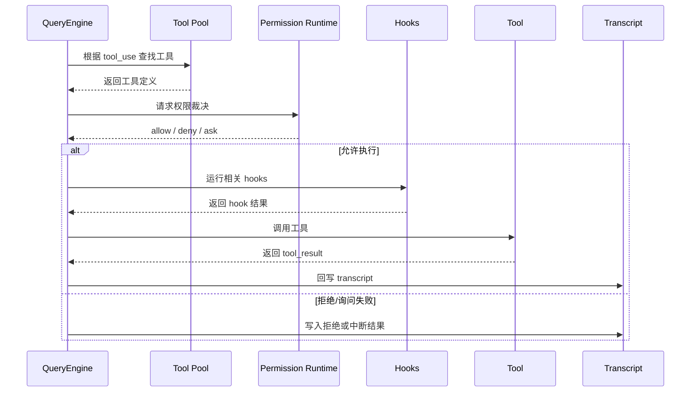
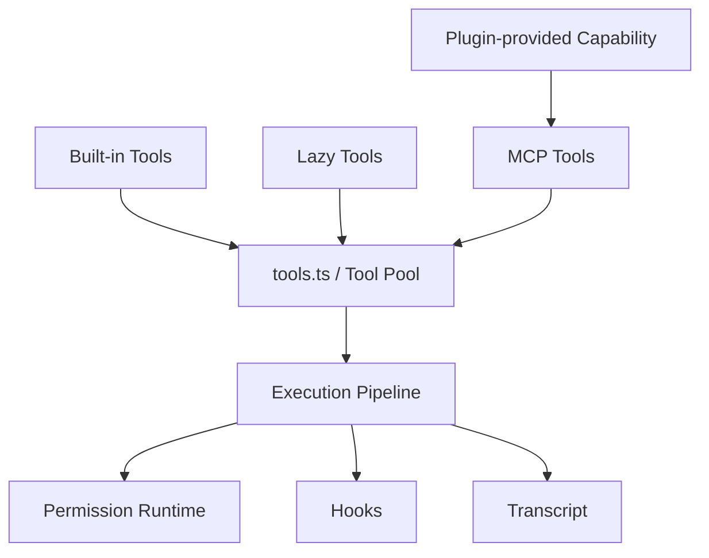

# 第 6 章：Tool 系统与执行管线

Claude Code 的力量，很大程度上来自 Tool 系统。但真正决定它是否可靠的，并不是“工具多不多”，而是这些工具怎样被定义、装配、授权和执行。

## 6.1 Tool 先是类型问题，再是能力问题

`note/read-145.md` 对 `Tool.ts` 的总结非常准确：Claude Code 先定义“什么才算一个工具”，然后才谈每个工具具体做什么。

这意味着：

- 每个工具都要有身份、schema、权限语义、并发语义、UI 展示语义；
- `tools.ts` 负责把内置工具、MCP 工具、延迟工具组织成一个稳定的工具池；
- prompt cache 的稳定性甚至会反过来影响工具排序与装配方式。

所以工具系统首先是一套契约系统。

## 6.2 执行管线为什么必须独立成章

从 `note/read-126.md` 与 `Lesson/tool-call-loop-architecture.md` 可以看出，一旦模型决定调用工具，系统还要做大量额外工作：

- 查找工具
- 校验输入 schema
- 检查权限
- 走 Hook
- 执行工具
- 规范化结果
- 写回 transcript

因此，工具并不是“模型直接碰到的函数”，而是被一条执行管线包围的受控能力。

## 6.3 工具执行时序图

## 6.4 工具池装配图

## 6.5 Bash、File、Grep、Agent、MCP 为什么能共存

从早期站点到后期综合文档都反复在说明一点：Claude Code 并不是把工具当成“一个个特例”。

无论是：
- Bash / PowerShell 这类执行型工具；
- Read / Edit / Write / Grep / Glob 这类代码感知工具；
- AgentTool 这类会引出子代理的元工具；
- MCPTool 这类外部能力适配器；

它们都必须先穿过统一 Tool 接口与执行管线，才算真正进入系统。

## 6.6 为什么工具层一定要被“制度化”

如果没有统一接口，Claude Code 当然也可以把 Bash、Read、Agent、MCP 一个个硬接进去；但那样系统很快就会失去三个关键能力：

- 无法稳定向模型声明“当前到底有哪些能力”；
- 无法在权限、审计、UI 展示上保持一致；
- 无法保证 tool_use 与 tool_result 在 transcript 中仍然是可追踪、可恢复的一对。

所以 Tool 层真正重要的，不是提供更多执行能力，而是把执行能力先变成**被运行时治理的对象**。

这也是为什么第二卷必须把 Tool、Permission、Hook 放在相邻章节里理解：它们共同构成的是 Claude Code 的执行制度层，而不只是几个碰巧相关的模块。

## 6.7 工具排序、发现与缓存为什么也属于架构问题

从 `tools.ts` 与相关综合笔记可以看到，工具池并不是一个静态数组。系统要同时处理：

- 内置工具与延迟工具的装配；
- MCP 工具的动态加入；
- 插件或远程形态带来的刷新；
- prompt cache 对稳定顺序的要求。

这意味着“工具发现”不是外围实现细节，而是会直接影响模型看到的能力面、上下文缓存命中率，以及每一轮 tool_use 的可预测性。

换句话说，Claude Code 并不是只关心“工具能不能运行”，它还关心“工具以什么秩序出现”，因为后者会反过来影响前者。

## 6.8 为什么 Tool 接口其实也是一种 UI 接口

Tool 在系统里并不只服务模型。它还要同时服务：

- 权限系统，判断是否允许执行；
- UI，决定怎样展示工具身份、输入与输出；
- transcript，决定历史里如何保留这次调用；
- 远程或结构化传输层，决定事件如何被编码。

所以 Tool 接口看似属于执行层，实际上也承担了内部协议层的职责。它是一种“给模型看的能力接口”，也是一种“给系统其他层读取的结构化事件接口”。

## 6.9 本章小结

本章希望留下的结论是：

> Claude Code 的工具系统真正厉害的地方，不是“接了很多工具”，而是“把所有工具都变成了一种可治理、可授权、可回写的同类对象”。

## 来源站点

- `note/read-98.md`
- `note/read-101.md` ~ `note/read-118.md`
- `note/read-126.md`
- `note/read-145.md`
- `Lesson/tool-system-architecture.md`
- `Lesson/tool-call-loop-architecture.md`
