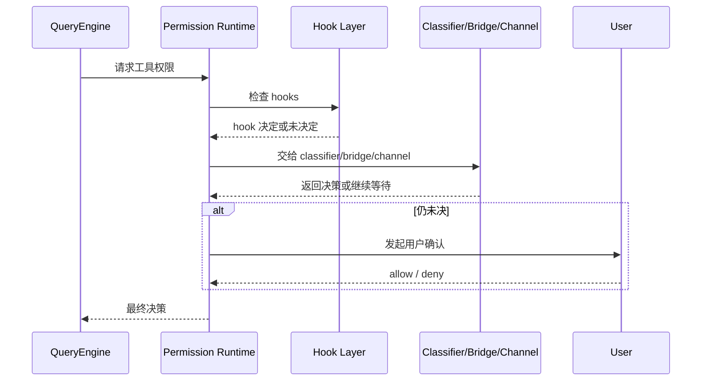

# 第 7 章：Permission、Hooks 与 Session Runtime

如果说 Tool 是 Claude Code 的“手”，那么 Permission、Hooks 与 Session Runtime 就是决定这双手何时能动、怎样动、动完以后系统是否还能保持秩序的制度层。

## 7.1 Permission 不是 if 判断，而是运行时制度

`note/read-136.md` 和早期权限站点已经明确指出：权限系统不是零散防线，而是一道正式总闸门。

它要同时处理：

- allow / deny / ask 的规则来源；
- hook、classifier、bridge、channel 等多路裁决来源；
- 自动模式与危险规则剥离；
- 用户交互与持久化规则更新。

这说明权限在 Claude Code 里不是工具附属校验，而是运行时核心制度。

## 7.2 Hook 为什么是横切面，而不是插件附属品

Hook 系统之所以复杂，不是因为“加了几个回调点”，而是因为 Claude Code 把生命周期真正开放了出来：

- 启动时机
- prompt 处理时机
- tool 调用前后
- post-sampling
- session 结束前后

所以 Hook 不只是自动化技巧，而是系统愿意把自己的内部节拍暴露给外部扩展的方式。

## 7.3 Permission 决策时序图

## 7.4 为什么 Permission Runtime 必须是“多来源裁决器”

从权限相关站点与综合总结里可以看出，Claude Code 并没有把权限问题简化成“配一个白名单”这么轻。它必须同时接住多种不同来源的信号：

- 用户当前会话中的明确选择；
- 历史上已经保存的规则；
- hook 给出的自动化判断；
- classifier、bridge、channel 等运行环境附带的制度约束；
- 不同工具自身的危险级别与语义类别。

这意味着 Permission Runtime 的职责，不是单次判断，而是把这些来源重新整合成一个**当前回合可执行的最终裁决**。

也正因为如此，权限系统才会成为第二卷的主角之一：它并不是附属的安全补丁，而是 Tool 系统真正能够落地执行的前提。

## 7.5 Hook 为什么是横切面，而不是插件附属品

Hook 系统之所以复杂，不是因为“加了几个回调点”，而是因为 Claude Code 把生命周期真正开放了出来：

- 启动时机
- prompt 处理时机
- tool 调用前后
- post-sampling
- session 结束前后

所以 Hook 不只是自动化技巧，而是系统愿意把自己的内部节拍暴露给外部扩展的方式。

## 7.6 Session Runtime 为什么决定了系统是否会慢慢失序

`note/read-139.md` 与 `note/read-141.md` 展示了另一件关键事情：一个长期运行的 CLI 会话，不只是“在那儿等输入”。

它还必须处理：

- scheduler / cron
- graceful shutdown
- shell 执行副产物
- transcript 与文件缓存
- session state、恢复与后台 housekeeping

这些能力决定了系统不会因为长时间运行、后台任务、远程状态或意外中断而慢慢失序。

## 7.7 Permission、Hook、Session Runtime 为什么应该并章理解

单独看 Permission，容易把它理解成安全闸门；单独看 Hook，容易把它理解成自动化接口；单独看 Session Runtime，又容易把它理解成后台杂务。

但把三者合在一起，就会看到它们共同处理的是同一个问题：

> 一个会持续运行、持续调用工具、持续接入外部扩展的系统，怎样在时间上一直保持可控。

Permission 负责“能不能做”，Hook 负责“在什么节拍上插入外部逻辑”，Session Runtime 负责“长时间运行后系统还能不能维持秩序”。三者合起来，才构成 Claude Code 的正式运行制度层。

## 7.8 本章小结

这一章真正要落下的判断是：

> Claude Code 的安全与稳定，不来自某一个防御点，而来自权限、Hook 与会话运行时共同构成的一整层制度化运行环境。

## 来源站点

- `note/read-61.md` ~ `note/read-70.md`
- `note/read-136.md`
- `note/read-138.md`
- `note/read-139.md`
- `note/read-141.md`
- `Lesson/permissions-and-safety-architecture.md`
- `Lesson/hooks-and-automation-architecture.md`
