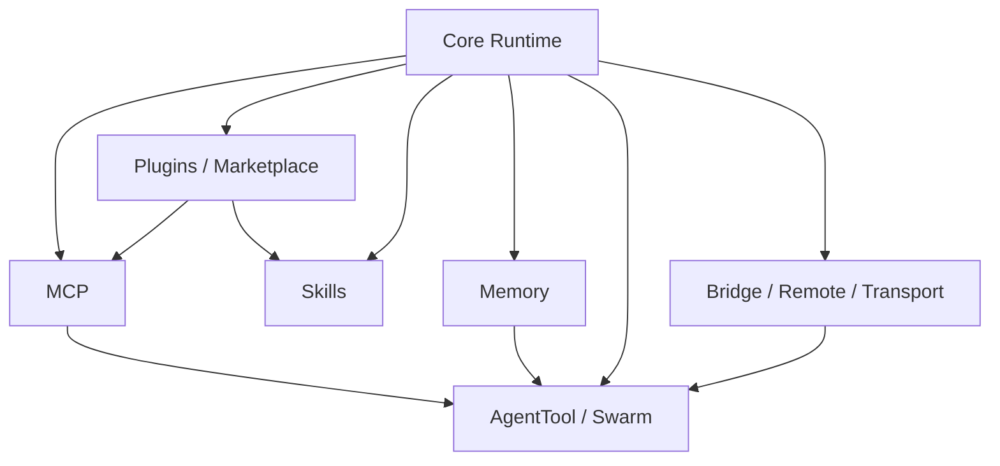

# 第三卷前言：扩展面与协作

到这一卷，Claude Code 已经不再只是“本地 CLI + 主循环 + 工具箱”的系统。它开始向外长出接口，向内长出组织结构。

这正是第三卷要处理的主题：

- MCP 让外部能力进入工具系统；
- Plugin 与 Skills 让能力可组合、可分发；
- Memory 让系统拥有跨回合与跨层次的持久上下文；
- AgentTool 与 Swarm 让单智能体系统开始拥有组织结构；
- Bridge、Remote、Transport 则把运行边界从本地终端扩展到远程环境与协议层。

## 本卷要回答的 3 个问题

1. Claude Code 怎样在不破坏核心运行时的前提下扩展能力？
2. 多智能体协作怎样从“多开几个 agent”变成一套制度化组织？
3. 本地会话、远程桥接与传输协议如何组成统一体验？

## 本卷架构图

## 本卷章节安排

- 第 8 章：MCP、Plugin 与 Skills
- 第 9 章：Memory、AgentTool 与 Swarm
- 第 10 章：Bridge、Remote 与 Transport

## 主要来源

- `note/read-71.md` ~ `note/read-100.md`
- `note/read-107.md`
- `note/read-124.md` ~ `note/read-146.md`
- `Lesson/mcp-integration-architecture.md`
- `Lesson/plugin-and-marketplace-architecture.md`
- `Lesson/memory-system-architecture.md`
- `Lesson/agent-team-architecture.md`
