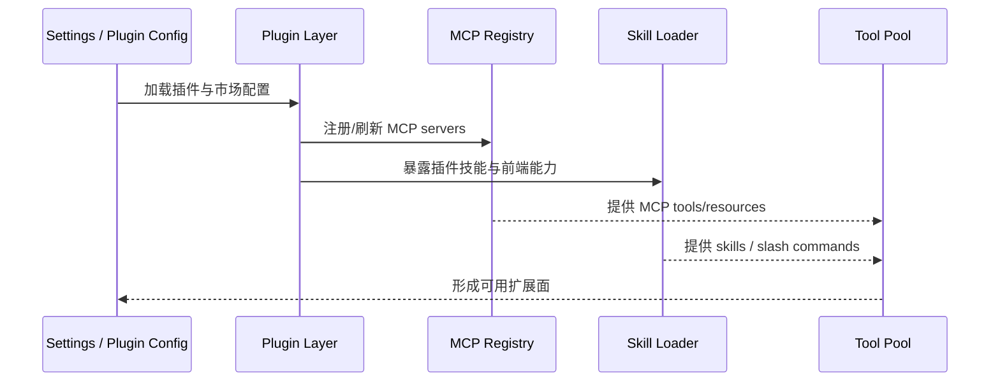

# 第 8 章：MCP、Plugin 与 Skills

Claude Code 的扩展面并不是一条通道，而是三条互相咬合的链：MCP、Plugin、Skills。

- MCP 负责把外部能力接进来；
- Plugin 负责把扩展能力打包、分发、安装和刷新；
- Skills 负责把这些能力整理成人类和模型都更容易调用的复用单元。

## 8.1 MCP 不是一个插件，而是一整条接入链

`note/read-110.md`、`note/read-132.md` 到 `note/read-134.md` 与 `book/chapter-10-mcp-integration.md` 共同说明，MCP 的关键不在于“多了些外部工具”，而在于它从配置、策略、传输、认证、注册、工具适配到资源读取，形成了一整条完整链路。

MCP 真正解决的问题是：

> 一个不断扩张的宿主系统，怎样给未知的外部能力预留统一接入口。

## 8.2 MCP 真正接入的不是功能，而是协议化能力

如果只从表面看，MCP 像是在把“外部工具”接进 Claude Code；但从源码结构看，它接入的其实是更深的一层：**协议化能力**。

这意味着外部 server 提供的东西，必须先被翻译成 Claude Code 能理解的对象：

- 工具如何命名；
- 资源如何列举与读取；
- 连接失败与认证失败怎样呈现；
- 配置来源与企业策略如何限制其生效范围。

因此 MCP 的真正价值，不是“让系统支持更多能力”，而是“让系统能够以统一方式接纳未知能力”。

## 8.3 Plugin 不只是安装包，而是热交换扩展层

从 `note/read-81.md` ~ `read-85.md` 与 `Lesson/plugin-and-marketplace-architecture.md` 可以看到，Plugin 系统并不是下载文件这么简单。它实际处理的是：

- marketplace 发现；
- 安装状态；
- plugin manifest；
- hooks / skills / MCP servers / 其他组件的整体刷新；
- runtime reconnect 和状态回写。

所以插件系统真正难的地方，是 **运行中的扩展接入秩序**。

更准确地说，Plugin 要解决的是：当系统已经在运行、会话已经建立、工具池已经存在时，新增能力怎样被安全地“热交换”进去，而不把现有状态打碎。

## 8.4 Skills 为什么夹在中间

`note/read-109.md` 与 `note/read-162` 相关总结都在强调：Skills 不是普通 prompt 模板，而是一次正式的上下文注入与能力包装。

它们把：
- frontmatter
- 可用工具限制
- 模型/effort/context modifier
- 本地或远程来源

统一成一种可被 slash command 直接调用的能力单元。

所以 Skills 之所以重要，不是因为它让命令更方便，而是因为它把零散能力重新整理成更高层的“操作语义”。

## 8.5 扩展链路时序图

## 8.6 为什么这三者必须并章理解

MCP、Plugin、Skills 分别处理的是：

- **MCP**：外部能力怎样以协议形式出现；
- **Plugin**：扩展怎样以安装/刷新/配置的形式进入当前会话；
- **Skills**：这些能力怎样被包装成更高层的可复用动作。

三者串起来，Claude Code 才真正拥有“扩展面”：
- 没有 MCP，就缺统一外部接入口；
- 没有 Plugin，就缺运行时接入与分发层；
- 没有 Skills，就缺人类与模型都能稳定调用的高阶操作单元。

## 8.7 本章小结

本章最重要的判断是：

> Claude Code 的扩展性，不是“后面再接点插件”，而是一整层正式架构：外部能力先被协议化、再被打包、再被技能化，最后才进入运行时。

## 来源站点

- `note/read-71.md` ~ `note/read-85.md`
- `note/read-109.md`
- `note/read-110.md`
- `note/read-132.md` ~ `note/read-136.md`
- `Lesson/mcp-integration-architecture.md`
- `Lesson/plugin-and-marketplace-architecture.md`
