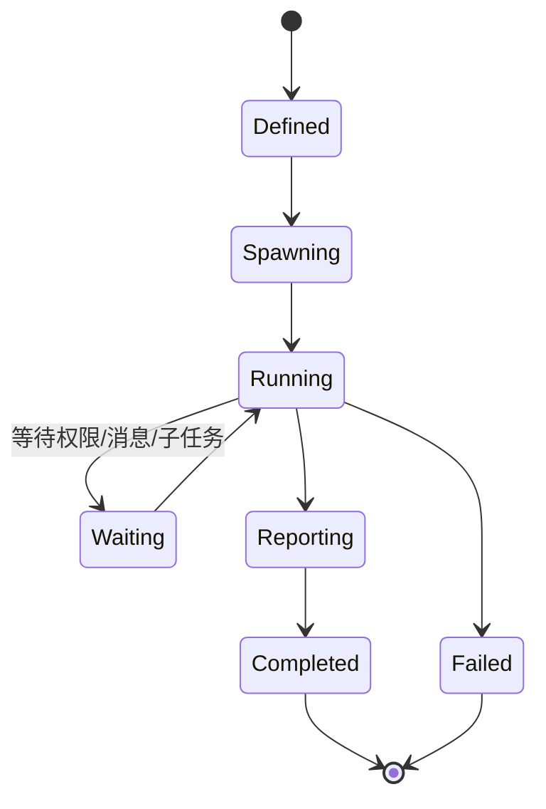
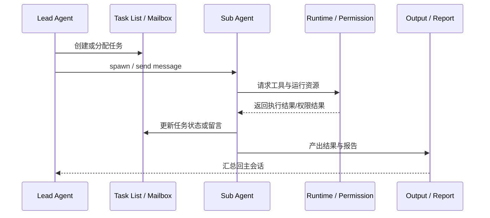

# 第 9 章：Memory、AgentTool 与 Swarm

这一章处理的是 Claude Code 最能体现“智能体系统”特征的一层：它不仅执行工具，还开始组织记忆、拆分角色、协调多个 agent 共同工作。

## 9.1 Memory 不是附加缓存，而是时间维度

从 `note/read-139`、`note/read-173`、`Lesson/memory-system-architecture.md` 到更早的 memory 站点都可以看到，Claude Code 对 memory 的处理并不是简单记笔记。它明确区分了：

- 会话级记忆
- CLAUDE.md / memdir 一类文件型上下文
- agent/team 相关的记忆边界

所以 memory 真正要解决的问题是：

> 会话怎样不只活在当前这一个回合里。

## 9.2 Memory 的关键不在“记住更多”，而在“分层记住”

`note/read-139.md` 与后段综合文档最值得提炼的一点，是 Claude Code 没有把所有记忆压成同一种机制。它承认至少存在几种完全不同的记忆时间尺度：

- 当前对话窗口里的即时上下文；
- 需要跨回合保留的 session memory；
- 以文件形式存在、可被人类与模型共同维护的 CLAUDE.md / memdir；
- 团队或 agent 级别的局部记忆边界。

这意味着 memory 真正回答的是：**什么信息该留在当前回合，什么该留下来，什么又必须在 agent 边界处被重新划分。**

## 9.3 AgentTool 为什么是元工具

`note/read-107.md` 已经点得很准：AgentTool 不是普通工具，它调用的是另一个 agent 执行单元。

也正因为如此，它同时牵扯：

- agent 定义加载
- 上下文传递
- 隔离与共享
- 后台任务与输出文件
- 恢复、消息传递、审批和工作树

因此 AgentTool 最终引出的不是“更多工具”，而是**系统内部的第二层行动者**。

## 9.4 Swarm 真正增加的是组织结构

从 `note/read-127.md`、`read-128.md`、`read-138.md` 与 `Lesson/agent-team-architecture.md` 看，Swarm 系统的关键不是并行，而是建制：

- 谁是 lead，谁是 teammate；
- 任务怎样分配；
- 权限怎样同步；
- mailbox / team file / task list 怎样让团队保持一致；
- 团队如何被创建、恢复、删除。

也就是说，Swarm 带来的不是“多线程感”，而是 Claude Code 内部第一次出现了**组织政治**：谁协调、谁执行、谁批准、谁向谁回报，都需要被结构化表达。

## 9.5 Agent 生命周期状态机

## 9.6 Agent / Swarm 协作时序图

## 9.7 为什么 Agent 生命周期不能只看“spawn 一次”

如果把 AgentTool 理解成“开一个子代理”，就会漏掉很多真正决定系统复杂度的部分。源码层真正关心的不是 spawn 这一瞬间，而是后续整条生命周期：

- 子 agent 用什么上下文启动；
- 它与主会话共享什么、不共享什么；
- 它如何等待权限、消息、后台任务；
- 它怎样把结果重新写回主线程可消费的形式；
- 它失败、超时、恢复时，系统怎样继续维持一致性。

所以 Agent 生命周期真正揭示的是：Claude Code 已经开始把“行动者本身”当成运行时对象治理，而不只是把 agent 当作一次性工具调用。

## 9.8 为什么 Memory 与 Swarm 必须放在同一章

它们看似是两回事：一个处理记忆，一个处理协作。但源码阅读越深入，越会看到两者其实在共同回答一个问题：

> 当 Claude Code 不再只是一个当前回合的单体助手时，系统怎样管理“谁知道什么、谁应该知道什么、谁把什么带到下一步”。

Memory 负责时间维度上的连续性，Swarm 负责角色维度上的连续性，而 AgentTool 则是把两者接起来的桥。

## 9.9 Memory 为什么同时服务“连续性”和“边界”

Memory 很容易被直觉理解成“越多越好”；但从 Claude Code 的设计看，它同样重视**不该混在一起的信息必须分开**。

这正是 memory 系统成熟的地方：

- 它让重要信息跨回合留下来；
- 但也防止所有历史、所有 agent 视角、所有局部上下文被粗暴混成一个大袋子；
- 它允许文件化记忆成为人类与模型共享的长期锚点；
- 也允许 session / team / agent 维持各自局部边界。

所以 memory 真正服务的不是“存储量”，而是长期协作中的信息结构。

## 9.10 本章小结

这一章最终要留下的判断是：

> Claude Code 一旦进入 AgentTool、Memory 与 Swarm 这层，就已经不再只是“一个会调用工具的 CLI”，而开始变成一套会分工、会记忆、会组织内部角色的智能体系统。

## 来源站点

- `note/read-86.md` ~ `note/read-100.md`
- `note/read-107.md`
- `note/read-124.md` ~ `note/read-126.md`
- `note/read-138.md`
- `note/read-139.md`
- `Lesson/memory-system-architecture.md`
- `Lesson/agent-team-architecture.md`
