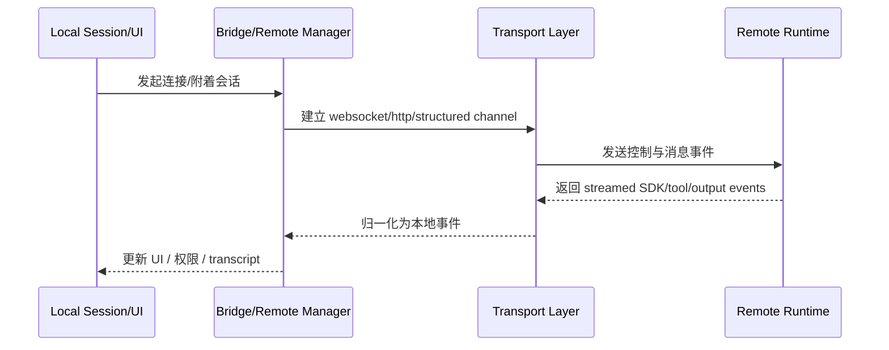

# 第 10 章：Bridge、Remote 与 Transport

到这一章，Claude Code 的边界已经从“本地终端里的运行时”扩展到“跨机器、跨协议、跨宿主的执行系统”。

Bridge、Remote 与 Transport 之所以应该放在一起，是因为它们共同处理一个问题：

> Claude Code 怎样把本地会话、远程环境和结构化协议，连成同一条可持续交互链。

## 10.1 Remote 不是副产品，而是第二张运行面

从 `note/read-135.md`、`note/read-146.md` 与相关 transport 综合文档可以看出，remote 路径并不是在本地会话外面再包一层网络。相反，它已经形成了一条正式协议栈：

- 连接建立与恢复
- 消息适配
- 权限桥接
- 远端事件流与本地 UI 的映射

这说明 remote 不是附加功能，而是 Claude Code 的第二张运行面。

## 10.2 Bridge 处理的是“本地机器怎样被远端调度”

Bridge 子系统尤其重要，因为它不是“客户端连服务器”的单一图景，而是把本地执行环境本身变成可被管理的运行目标：

- 会话管理
- 心跳与重连
- worktree 与执行环境
- work secret 与权限边界
- 远端控制和本地执行的缝合

换句话说，Bridge 把 Claude Code 从“在我电脑上跑的 CLI”推进到“我的电脑本身就是一段可被调度的执行现场”。

## 10.3 Transport 负责把体验稳定成协议

`note/read-146.md` 对 Transport 的总结非常关键：如果没有 transport 层，Claude Code 的各种 remote / SDK / bridge 形态就只能依赖各自零散的传输方式。

而 transport 层的意义，在于：

- 明确消息如何 framing；
- 明确控制信息与业务消息怎样分离；
- 明确连接、恢复、批量上传、流式输出等机制；
- 把“本地 REPL 体验”翻译成“远程/结构化环境也能稳定承接的协议行为”。

## 10.4 Remote / Bridge 时序图

## 10.5 为什么 Remote、Bridge、Transport 应该并章阅读

这三个子系统分别强调的是：

- **Remote**：会话在另一端如何持续存在；
- **Bridge**：本地执行环境如何被远程操控；
- **Transport**：两端如何以统一协议交换事件。

单独看任何一个，都容易把问题缩小成“网络通信”；合在一起看，才会发现它们真正回答的是：

> Claude Code 如何让执行位置、控制位置与显示位置彼此分离，却仍维持单一会话心智模型。

## 10.6 本章小结

这一章最终要留下的判断是：

> Bridge、Remote 与 Transport 让 Claude Code 从“一个在本地终端里运行的程序”，变成“一个可以跨机器延展、却仍保持同一交互秩序的协议化系统”。

## 来源站点

- `note/read-135.md`
- `note/read-136.md`
- `note/read-146.md`
- `Lesson/full-system-architecture.md`
- `book/chapter-11-transport-and-sdk.md`
- `book/chapter-12-remote-and-ccr.md`
