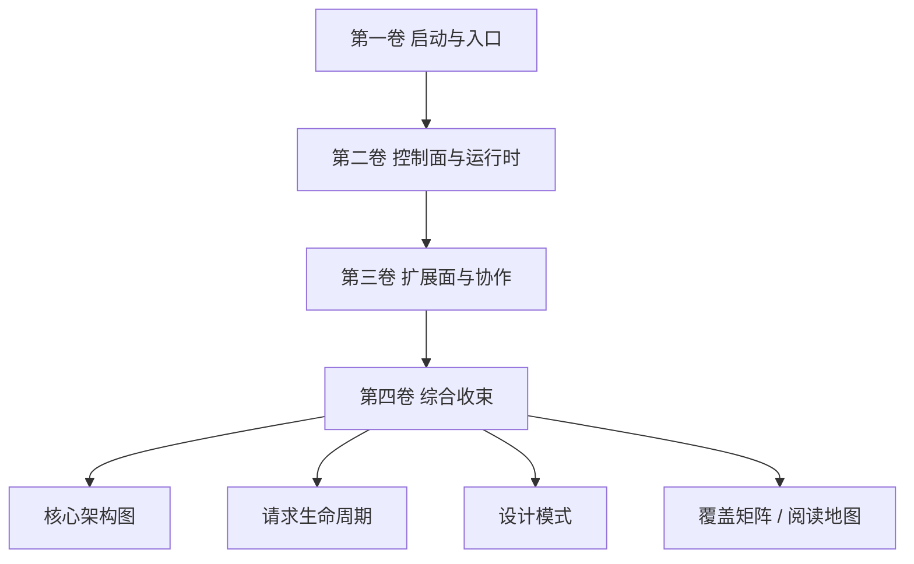

# 第四卷前言：系统总览与综合收束

前面三卷已经分别解释了 Claude Code 的启动链、控制面与扩展面。但读到这里，真正重要的问题变成了另一个：

> 如果不再按站点推进，Claude Code 到底可以被还原成哪几条最稳定的骨架？

第四卷要做的，就是把前面的细节重新压缩成系统级视图：

- 核心架构总图
- 一条端到端请求生命周期
- 安全、可靠性、性能等横切设计模式
- 覆盖矩阵与后续阅读地图

## 本卷要回答的 3 个问题

1. 把分散在前面三卷中的局部结构压回整体脑图。
2. 让读者能从“知道很多模块”上升到“知道这些模块如何彼此咬合”。
3. 把 `note/read-143.md` 这类索引型材料，升级为真正的书稿收束层。

## 本卷架构图

## 为什么第四卷不是简单总结

如果只是复述前三卷，第四卷就没有必要单独存在。它真正要做的，是把前三卷里已经拆开的东西重新折叠回来：

- 第一卷讲入口和启动，但第四卷要说明这些入口最后怎样嵌进整套系统；
- 第二卷讲运行时和制度层，但第四卷要说明这些控制机制为什么构成系统真正中枢；
- 第三卷讲扩展与协作，但第四卷要说明这些边界拉开之后，系统骨架为什么仍然没有散掉。

所以第四卷的作用不是“再说一遍”，而是把前面已经理解到的局部，重新压缩成稳定心智模型。

## 这一卷最适合怎样读

- 如果你已经读完前三卷：这一卷适合用来收束全书判断；
- 如果你还没开始读正文：这一卷也可以作为整本书的预览图；
- 如果你是从 `note/` 逐站笔记回跳过来：这一卷是把零散站点重新折回系统地图的最佳入口。

## 本卷章节安排

- 第 11 章：核心架构总图
- 第 12 章：端到端请求生命周期
- 第 13 章：设计模式、覆盖矩阵与阅读地图

## 主要来源

- `note/read.md`
- `note/read-138.md`
- `note/read-143.md`
- `note/read-146.md`
- `Lesson/full-system-architecture.md`
- `Lesson/README.md`
