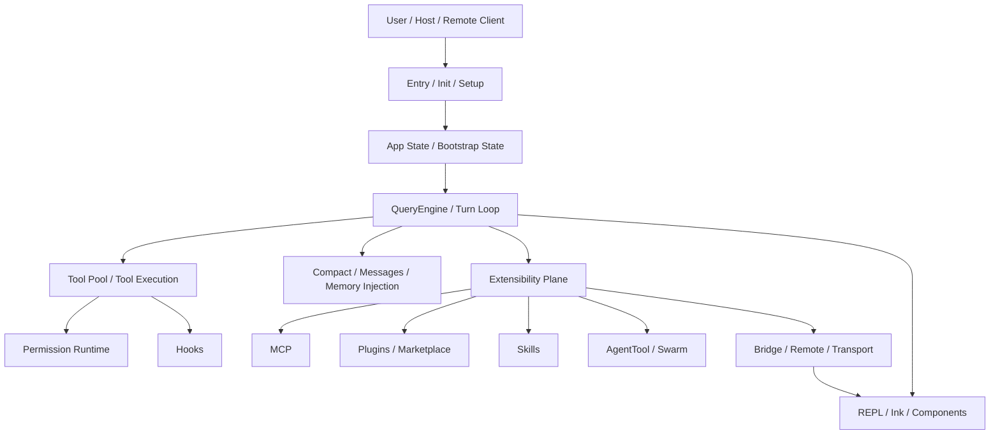

# 第 11 章：核心架构总图

如果前面三卷分别解释了 Claude Code 的局部结构，那么这一章要做的是把这些局部重新压缩回整体脑图。

Claude Code 最容易被误读成三层系统：CLI、主循环、工具。但结合 `note/read-143.md`、`note/read-145.md`、`note/read-146.md` 与 `Lesson/full-system-architecture.md`，更准确的理解应该是：

- 它有清晰的入口与启动编排层；
- 有 QueryEngine 为核心的会话控制面；
- 有 Tool / Permission / Hook 为代表的执行制度层；
- 有 MCP / Plugin / Memory / Agent / Remote 为代表的扩展与协作层；
- 还有 UI / Transport / Remote 这些把内部机制外显出来的接口层。

## 11.1 全书核心架构图

## 11.2 为什么要把系统拆成这几层

### 启动与入口层
决定系统从什么宿主姿态进入。

### 控制面与运行时层
决定一次对话如何被运行、收束与恢复。

### 执行制度层
决定工具能否被用、如何被用、结果如何写回。

### 扩展与协作层
决定系统怎样接入外部能力，怎样组织多个行动者。

### 接口与传输层
决定这些内部结构如何被用户、SDK 或远程环境看见。

## 11.3 为什么这张总图不是“模块清单”

总图最大的价值，不在于把目录列全，而在于把 Claude Code 的结构重心暴露出来。

例如从图中就可以直接看出几件重要的事情：

- QueryEngine 是真正的中枢，而不是附属层；
- Tool 执行必须经过 Permission 与 Hooks 这层制度化边界；
- 扩展能力并不直接挂在 UI 上，而是通过运行时核心进入系统；
- Remote/Transport 不是外围接口，它会反过来影响 UI 和会话体验。

这说明 Claude Code 的复杂度不是平均分布的，而是围绕几个关键汇聚点组织起来的：入口、回合引擎、执行制度、扩展平面与接口层。

## 11.4 从总图往回看前三卷

如果倒着重新理解前面三卷，可以把它们看成是在依次解释这张图：

- 第一卷解释 `ENTRY -> APP -> UI` 的建立；
- 第二卷解释 `QUERY -> TOOLS -> PERM/HOOKS -> CONTEXT` 的运转；
- 第三卷解释 `EXT -> MCP/PLUGIN/SKILL/AGENT/REMOTE` 的扩展。

这样一来，第四卷的意义就不只是总结，而是把前三卷重新折叠回一张稳定的系统地图。

## 11.5 本章小结

> 核心架构图真正提供的，不是“把模块都列出来”，而是让人看清 Claude Code 的稳定骨架：入口、控制、执行、扩展、接口五层共同构成一套复合系统。

## 来源站点

- `note/read.md`
- `note/read-126.md`
- `note/read-142.md`
- `note/read-143.md`
- `note/read-145.md`
- `note/read-146.md`
- `Lesson/full-system-architecture.md`
