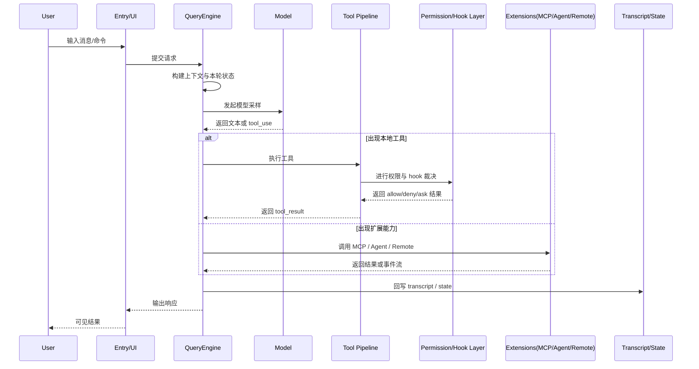
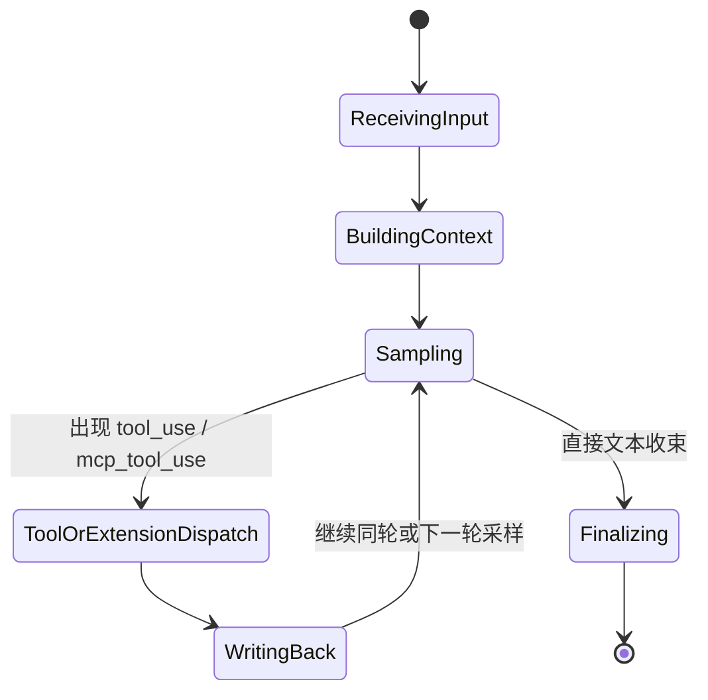

# 第 12 章：端到端请求生命周期

这一章试图回答一个贯穿全书的问题：从用户输入一条消息，到 Claude Code 输出结果，中间到底发生了什么？

这条链路之所以值得专章，是因为它不是一段线性的“问-答”流程，而是一条会穿过：

- 输入预处理
- 上下文装配
- QueryEngine / Turn Loop
- Tool 执行
- Permission / Hook 裁决
- transcript 回写
- 必要时的 compact、agent、remote 或 MCP 分支

## 12.1 端到端时序图

## 12.2 回合流转状态机

## 12.3 为什么这条链会这么长

因为 Claude Code 不是一个纯文本聊天器。它同时承担：

- 作为 CLI 程序的宿主职责；
- 作为会话系统的 turn 管理职责；
- 作为执行系统的工具与权限职责；
- 作为扩展平台的 MCP / Plugin / Agent / Remote 职责。

也就是说，一次请求并不是“经过很多中间层”，而是本来就要跨越很多制度边界。

## 12.4 端到端生命周期里最关键的不是“调用模型”

如果只看表面流程，很容易把模型调用当成整条链的中心；但把前后文都算上之后，会发现真正稳定系统的是另外几件事：

- 调用前，系统能否把 system prompt、用户上下文、工具能力与历史 transcript 组织成一个有效回合；
- 调用中，系统能否识别文本输出、tool_use、mcp_tool_use 等不同分支；
- 调用后，系统能否把工具副作用、权限裁决和中断恢复重新缝回同一条历史。

所以模型采样当然重要，但它只是端到端生命周期中的一个高密度节点，而不是整条链的全部。

## 12.5 为什么 transcript 回写决定了“会话”是否成立

很多系统在架构图里都会强调“请求怎么发出去”，但 Claude Code 的特殊之处在于，它同样重视“结果怎样回来并留下痕迹”。

这正是 transcript / state 回写在端到端路径里的作用：

- 它把一次模型输出变成后续轮次可引用的历史；
- 它把一次工具执行变成可追踪的系统事件；
- 它让 compact、resume、remote attach 这类机制有稳定落点；
- 它保证系统不会因为中途分支太多，就失去对当前会话位置的判断。

从这个角度看，Claude Code 的“端到端”并不是请求走到结果为止，而是结果必须重新沉淀成下一轮还能继续使用的状态。

## 12.6 为什么要把本地工具、MCP、Agent、Remote 放进同一条生命周期

站在用户表面体验看，这几类能力像是不同功能；但从系统视角看，它们都只是 QueryEngine 在某个回合里触发的执行分支。

它们的共同点是：

- 都要被当前回合上下文显式声明或注入；
- 都会产生需要回写 transcript 的结果；
- 都可能改变下一次采样时模型所看到的局面；
- 都必须被权限、恢复与连续性机制纳入同一条时钟。

因此，把它们放进同一章，不是为了把所有能力混成一团，而是为了看清 Claude Code 如何把大量异构动作组织成单一会话节拍。

## 12.7 本章小结

> Claude Code 的端到端生命周期，真正揭示的是：一条用户消息并不会直达模型，也不会在模型处终止，它会在整个系统内部来回穿越，直到被组织成一个可恢复、可追踪、可再继续的会话事件。

## 来源站点

- `note/read.md`
- `note/read-126.md`
- `note/read-130.md`
- `note/read-137.md`
- `note/read-143.md`
- `note/read-146.md`
